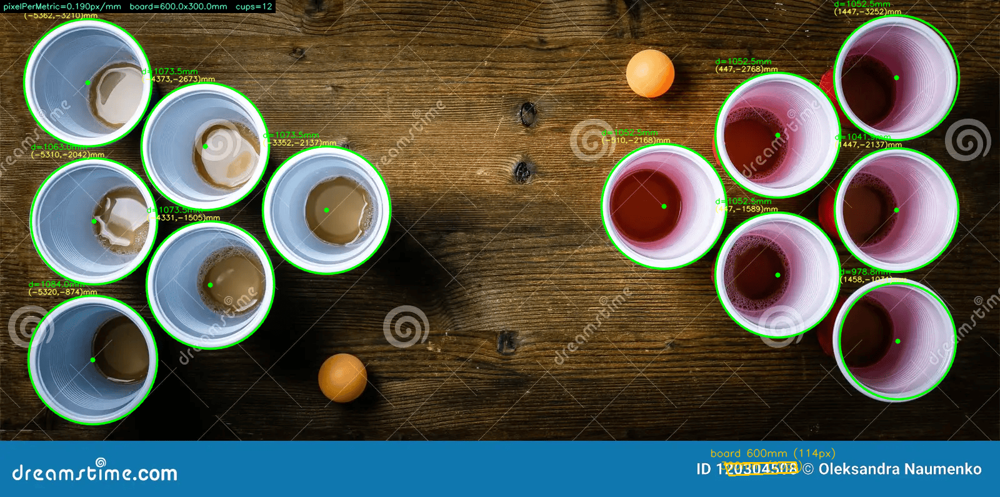

# RMS Group 9 - Robotic Manipulation System with Image Processing

A complete robotic arm system integrated with computer vision for automated cup detection and manipulation. This project combines **real-time image processing** with **inverse kinematics control** to enable a 4-DOF robot arm to autonomously identify and pick up drinking cups.

---

## 📋 Project Overview

The RMS system automatically detects cups (pint, half-pint, and shot glasses) in a live video feed using **OpenCV's Hough Circle Transform**, calculates their positions and sizes using reference-board calibration, and controls a 4-DOF robot arm to pick them up.

### Key Features
- ✅ **Real-time cup detection** via webcam with 3 cup size classifications
- ✅ **Reference-board calibration** for accurate millimeter-scale measurements
- ✅ **Inverse kinematics solver** for 2-link planar manipulator
- ✅ **ESP32-based robot control** with stepper + servo motors
- ✅ **Serial communication** between PC and microcontroller
- ✅ **Interactive parameter tuning** for different lighting conditions

---

## 🏗️ System Architecture

### Hardware Components

| Component | Purpose | Details |
|-----------|---------|---------|
| **Webcam (USB)** | Vision system | Mounted overhead at 460mm height |
| **ESP32 Microcontroller** | Main controller | Manages all motors and receives commands |
| **Stepper Motor** | Base rotation (DOF 1) | 200 steps/rev, rotates base about vertical axis |
| **Servo (Shoulder)** | Link 1 rotation (DOF 2) | Positioned at pin 25 |
| **Servo (Elbow)** | Link 2 rotation (DOF 3) | Positioned at pin 26 |
| **Servo (Gripper)** | End effector (DOF 4) | Parallel gripper on pin 27 |

### Software Stack
- **Python 3.x** - Image processing and coordinate calculation
- **OpenCV (cv2)** - Circle detection and image manipulation
- **NumPy** - Numerical computations
- **PySerial** - PC-to-ESP32 communication
- **Arduino/C++** - ESP32 firmware for motor control

---

## 📁 Project Structure

```
Scripts/
├── webcam.py              # Real-time webcam capture & cup detection
├── measure.py             # Reference-board calibration & measurement
├── robot-kin.py           # Inverse kinematics solver for 2-link arm
├── params.py              # HoughCircles parameter sets (tuned per trial)
├── Test.py                # Testing utilities
├── Trial-1.py             # Test script for Trial 1 parameters
├── Trial-2.py             # Test script for Trial 2 parameters
├── esp32_receiver/
│   └── esp32_receiver.ino # ESP32 stepper motor control
└── robot_control/
    └── robot_control.ino  # ESP32 full robot arm controller (4-DOF)

Images/
├── test.png               # Test image for parameter tuning
├── IMG_2856.jpeg          # Trial 1 reference image
└── IMG_2857.JPG           # Trial 2 reference image

Outputs/
├── measure/
│   ├── result.png         # Detected circles with measurements
│   ├── debug.png          # Three-panel debug visualization
│   └── circles.txt        # Cup measurements in mm
├── Trial-1/
│   └── circles.txt        # Trial 1 results
├── Trial-2/
│   └── circles.txt        # Trial 2 results
└── webcam/
    └── capture_*.txt      # Webcam session results
```

---

## 🎬 How It Works

### 1. **Image Capture & Preprocessing** (`webcam.py`)

The system captures frames from an overhead webcam and processes them to detect cup rims:

```
Raw Frame → CLAHE (Contrast) → Bilateral Blur → Edge Detection → Hough Circle Transform
                                                                         ↓
                                    Detected Circles (sorted by size, NMS applied)
```

**Key Parameters:**
- **CAMERA_HEIGHT_MM**: 460mm (distance from camera to table)
- **CAMERA_HFOV_DEG**: 60° (horizontal field of view)
- Cup diameter ranges: Pint (70-90mm), Half-Pint (50-60mm), Shot (40-50mm)

### 2. **Cup Classification**

Detected circles are classified by diameter:
- **Pint Cup**: 70-90mm diameter (green outline)
- **Half-Pint Cup**: 50-60mm diameter (orange outline)  
- **Shot Glass**: 40-50mm diameter (blue outline)
- **Unknown**: Outside range (gray outline)

### 3. **Reference-Board Calibration** (`measure.py`)

For accurate real-world measurements, the system calibrates using a reference board:

- **Board dimensions**: 600mm × 300mm (editable in `measure.py`)
- **Detection modes**:
  - `"auto"`: Automatically finds largest rectangular contour
  - `"manual"`: Uses user-specified corner pixels

Conversion formula:
```
pixelPerMetric = board_pixel_width / BOARD_WIDTH_MM
diameter_mm = 2 * radius_px / pixelPerMetric
position_mm = (center_px - board_corner_px) / pixelPerMetric
```

### 4. **Inverse Kinematics** (`robot-kin.py`)

Solves the 2-link planar manipulator IK problem:

**Link specifications:**
- L1 (shoulder to elbow): 200mm
- L2 (elbow to end effector): 200mm

**Solved angles:**
- Base rotation: `atan2(Y, X)` - rotates entire arm about vertical axis
- Shoulder angle: Derived from law of cosines
- Elbow angle: `acos((dist² - L1² - L2²) / (2·L1·L2))`

**Reachability check:** Target must satisfy: `|L1 - L2| ≤ distance ≤ L1 + L2`

### 5. **Robot Control** (`robot_control.ino`)

The ESP32 executes commands from the PC:
- Stepper motor steps the base into position
- Servo PWM signals move shoulder, elbow, and gripper
- Serial protocol: `[base_steps, shoulder_angle, elbow_angle, gripper_state]`

---

## 📸 Visual References

### Test Image
The system processes overhead camera feeds to detect cup rims:


*Example test image used for parameter tuning*

### Detected Cups with Reference Board
The measure.py script identifies cups and measures their position and diameter:



*Detected circles overlaid on the reference board with measurements*

### Debug Visualization
Multi-stage preprocessing visualization to understand detection pipeline:


*Left: Grayscale input | Center: Processed (CLAHE + Bilateral blur) | Right: Edge detection*

---

## 🚀 Usage Guide

### Setup
1. **Environment**: Activate the Python virtual environment
   ```bash
   .venv\Scripts\Activate.ps1
   ```

2. **Install dependencies**:
   ```bash
   pip install opencv-python numpy pyserial
   ```

3. **Configure camera**:
   - Edit `Scripts/webcam.py`:
     - `CAMERA_INDEX`: 0 for laptop, 1 for USB webcam
     - `CAMERA_HEIGHT_MM`: Measure your setup's camera height
     - `SERIAL_PORT`: Match your ESP32 COM port

### Running the System

#### **Option 1: Real-time Webcam Detection**
```bash
cd Scripts
python webcam.py
```
- Press **C** to capture and detect cups
- Press **Q** to quit
- Results saved to `Outputs/webcam/`

**What happens:**
1. Captures live frame from webcam
2. Applies preprocessing (CLAHE + bilateral filter)
3. Runs Hough Circle Transform
4. Removes overlapping circles using Non-Maximum Suppression (NMS)
5. Classifies cups by diameter
6. Attempts serial connection to ESP32 and sends arm commands

#### **Option 2: Measure from Static Image**
```bash
cd Scripts
python measure.py
```
- Configure `IMAGE_PATH`, `MODE` (auto/manual), and board dimensions
- Outputs to `Outputs/measure/`:
  - `result.png`: Circles with labels
  - `debug.png`: Preprocessing visualization
  - `circles.txt`: Cup measurements table

**Measurement accuracy:**
- Automatically detects the reference board and calibrates pixel-to-mm conversion
- All measurements in real-world millimeters (mm)

#### **Option 3: Test Robot Kinematics**
```bash
cd Scripts
python robot-kin.py
```
- Tests IK solver with example coordinates (150, 100, 50) mm
- Outputs joint angles for target position
- Shows reachability status

### Parameter Tuning

Use `params.py` to manage HoughCircles parameters across different lighting/setup conditions:

```python
from params import TRIAL_1, TRIAL_2, ALL_TRIALS
```

Currently tuned sets:
- **TRIAL_1**: Optimized for `Images/test.png` - Gaussian blur, dp=0.8, minDist=211
- **TRIAL_2**: Optimized for `Images/IMG_2856.jpeg` - dp=1.2, minDist=182

To create new parameters:
1. Run `webcam.py` with interactive tuning via trackbars
2. Note the optimal values from the status bar
3. Add a new entry to `params.py` with all HoughCircles parameters

---

## 🔧 Key Configuration Parameters

### Camera Settings (`webcam.py`)
```python
CAMERA_INDEX = 1              # 0=laptop, 1=USB
CAMERA_HEIGHT_MM = 460.0      # Height above table (mm)
CAMERA_HFOV_DEG = 60.0        # Horizontal FOV (degrees)
SERIAL_PORT = "COM3"          # ESP32 COM port
SERIAL_BAUD = 115200          # Communication speed
```

### Cup Diameters (`webcam.py`)
```python
PINT_DIAM_MM = (70, 90)       # Pint glass range
HALF_PINT_DIAM_MM = (50, 60)  # Half-pint range
SHOT_DIAM_MM = (40, 50)       # Shot glass range
CUP_INTERIOR_MIN_BRIGHTNESS = 150  # Brightness threshold for cup detection
```

### Board Calibration (`measure.py`)
```python
BOARD_WIDTH_MM = 600.0        # Reference board width
BOARD_HEIGHT_MM = 300.0       # Reference board height
MODE = "auto"                 # "auto" for contour detection or "manual" for fixed corners
```

### Robot Dimensions (`robot-kin.py` & `robot_control.ino`)
```
L1 = 200.0 mm    # Shoulder to elbow
L2 = 200.0 mm    # Elbow to end effector
STEPS_PER_REV = 200  # Stepper motor steps
```

---

## 📊 Output Files

### Measurement Results (`Outputs/measure/`)

**circles.txt** - Tab-separated table:
```
idx  center_x_mm  center_y_mm  diam_mm  cup_type
0    150.2        120.5        75.3     Pint
1    250.1        180.3        52.1     Half-Pint
```

**result.png** - Annotated image with:
- Board outline (white rectangle)
- Detected circles colored by type (Green=Pint, Orange=Half-Pint, Blue=Shot)
- Diameter labels in mm next to each circle

**debug.png** - Three-panel diagnostic image:
- **Left Panel**: Grayscale input from camera
- **Center Panel**: Processed image (CLAHE + bilateral filter applied)
- **Right Panel**: Edge detection result from Canny detector

---

## ⚙️ Algorithm Details

### Hough Circle Detection Pipeline

1. **Preprocessing**:
   - Convert to grayscale
   - Apply CLAHE (Contrast Limited Adaptive Histogram Equalization) for brightness normalization
   - Bilateral filter to preserve edges while reducing noise

2. **Edge Detection**:
   - Canny edge detector with configurable thresholds (param1=high, param2=low)

3. **Circle Detection**:
   - Hough Circle Transform accumulates votes from edge pixels
   - `dp`: Accumulator resolution (1.2 = higher precision)
   - `minDist`: Minimum distance between circle centers
   - `minRadius`, `maxRadius`: Filter circles by size

4. **Post-Processing**:
   - Non-Maximum Suppression (NMS) removes overlapping circles
   - Interior brightness check filters noise
   - Classification by diameter range

### Inverse Kinematics

The 2-link arm reaches a target (X, Y, Z) in three steps:

1. **Base Rotation**: `θ₀ = atan2(Y, X)` - orients arm toward target in XY plane
2. **Law of Cosines**: Solves for elbow angle using distance constraint
3. **Shoulder Angle**: Combines vertical component with elbow constraint

Reachability condition: `|200-200| ≤ distance_to_target ≤ 200+200` → `0 ≤ distance ≤ 400 mm`

---

## 🐛 Troubleshooting

### Issue: No cups detected
**Symptoms**: No circles found even with cups present
- ✓ Check lighting - ensure bright cup interiors (white ceramic preferred)
- ✓ Lower `CUP_INTERIOR_MIN_BRIGHTNESS` from 150 to ~100 in dim lighting
- ✓ Verify camera height matches `CAMERA_HEIGHT_MM` (460mm)
- ✓ Run interactive parameter tuning and increase `param2` (vote threshold)
- ✓ Check cup diameter ranges are correct for your cups

### Issue: Wrong cup classification
**Symptoms**: Cups classified as wrong size
- ✓ Physically remeasure actual cup outer diameters
- ✓ Update diameter ranges in `webcam.py` (PINT_DIAM_MM, etc.)
- ✓ Re-run calibration with `measure.py` using reference board
- ✓ Verify camera height - affects apparent cup size

### Issue: Serial connection fails
**Symptoms**: "Unable to open serial port COM3" error
- ✓ Check ESP32 is recognized: `Device Manager → COM ports`
- ✓ Update `SERIAL_PORT` to correct COM number
- ✓ Verify baud rate: `SERIAL_BAUD = 115200`
- ✓ Ensure USB cable is properly connected
- ✓ Try different USB port (USB 3.0 sometimes unreliable)

### Issue: Inverse kinematics unreachable
**Symptoms**: "Target is unreachable" message
- ✓ Target position outside arm reach envelope (max 400mm radius, 0-200mm height)
- ✓ Check link lengths match hardware (L1=200mm, L2=200mm in code)
- ✓ Verify shoulder height above table in `robot_control.ino`
- ✓ Cup position may be too far - bring robot/camera closer

### Issue: Stepper motor stalls
**Symptoms**: Motor doesn't turn or steps are jerky
- ✓ Increase `STEP_DELAY_US` in `robot_control.ino` (default 1500)
- ✓ Check power supply to ESP32 (needs stable 5V)
- ✓ Verify stepper pins (18=STEP, 19=DIR) are correct
- ✓ Reduce load on motor shaft

---

## 📝 Files Reference

### Main Scripts

| File | Purpose | Key Functions |
|------|---------|---|
| `webcam.py` | Real-time detection | `detect_cups()`, `classify()`, `nms()` |
| `measure.py` | Static image measurement | `detect_board_auto()`, `apply_perspective()` |
| `robot-kin.py` | Inverse kinematics | `solve_ik()` - computes joint angles |
| `params.py` | Parameter storage | `TRIAL_1`, `TRIAL_2` - tuned HoughCircles params |

### Arduino Firmware

| File | Purpose | Functionality |
|------|---------|---|
| `esp32_receiver/esp32_receiver.ino` | Basic stepper control | Test stepper motor direction/speed |
| `robot_control/robot_control.ino` | Full robot arm controller | Manages all 4 DOF, parses serial commands |

---

## 📞 Support & Documentation

For detailed algorithm explanations, see inline comments in:
- `Scripts/webcam.py` - Circle detection & classification logic (lines 80-150)
- `Scripts/measure.py` - Reference board calibration details (lines 70-120)
- `Scripts/robot-kin.py` - Inverse kinematics derivation (law of cosines explanation)
- `Scripts/robot_control/robot_control.ino` - Hardware control protocol & timing

---

## 🎓 Project Background

**RMS Group 9** - Mechanical Systems Design Course  
**Objective**: Design an autonomous system to identify and manipulate objects using computer vision and robotics

**System integrates:**
- 2D image processing (OpenCV)
- 3D coordinate geometry (kinematics)
- Real-time control (serial communication)
- Hardware actuation (motors and servos)

---

*Last Updated: April 2026*
*Python Version: 3.6+*
*OpenCV Version: 4.0+*
